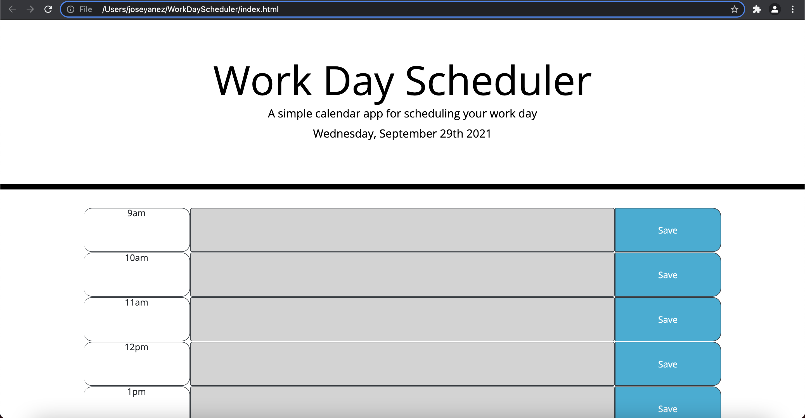

# WorkDayScheduler

Website: Work Day Scheduler

This is a project I did for the University of Denver Coding Bootcamp. A lot of the HTML and CSS were given to me as starter code.

The page runs using Javascript, HTML and CSS.

The page is used to save daily tasks which are saved via local storage.

My assignment was as follows:

AS AN employee with a busy schedule
I WANT to add important events to a daily planner
SO THAT I can manage my time effectively

My Acceptance Criteria was as follows:

GIVEN I am using a daily planner to create a schedule
WHEN I open the planner
THEN the current day is displayed at the top of the calendar
WHEN I scroll down
THEN I am presented with timeblocks for standard business hours
WHEN I view the timeblocks for that day
THEN each timeblock is color coded to indicate whether it is in the past, present, or future
WHEN I click into a timeblock
THEN I can enter an event
WHEN I click the save button for that timeblock
THEN the text for that event is saved in local storage
WHEN I refresh the page
THEN the saved events persist

 The additions made to the HTML have been commented as well as explainations for code that was already there. The entire Javascript code was written by me and is commented.

This is a link to the deployed web page: https://josey9087.github.io/WorkDayScheduler/

Below is a screenshot of the deployed web page:

